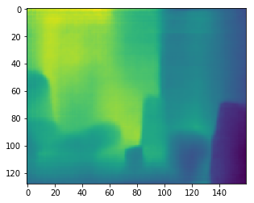

# SynthText_unicode_version

this project borrowed from [Ankush](https://github.com/ankush-me/SynthText), some code and setting referenced from [SynthText_Chinese_version](https://github.com/JarveeLee/SynthText_Chinese_version)   
this project can run on windows and linux environment.

## requirement
python 3.5+   
pygame  
tensorflow 1.4.0+


## 1 - if you want to use your text corpus
  1.1 put the corpus in "SynthText_unicode_version/data/corpus/"   
  1.2 then you need update the file "SynthText_unicode_version/data/models/char_freq.cp", so run the command:
```
python tools/update_freq.py --corpusPath data/corpus --outputPath data/models
```
## 2 - if you want to use your font
  2.1 put the font in "SynthText_unicode_version/data/fonts/"   
  2.2 then you need update the file "SynthText_unicode_version/data/models/font_px2pt.cp", so run the command:
```
 python tools/font_pixel2pt.py --fontDirPath data/fonts --outputPath data/models
```

PS: the file "SynthText_unicode_version/data/models/colors_new.cp" could not be update, because this is **Color-model (foreground/background text color model), learnt from the IIIT-5K word dataset**. the file is used to render the text when the program choose an **foreground string** from text corpus, then put the text onto a rander **color background**, so it's ok to use the file.   
## 3 - if you want to add new background image
  **3.1 get the images' depth**   
put the new background images in "SynthText_unicode_version/data/bgi/", then   
```
cd SynthText_unicode_version/tools/depthPrediction_tensorflow/code
```
read [this](https://github.com/ChanChiChoi/SynthText_unicode_version/tree/master/tools/depthPrediction_tensorflow) or just directly download [NYU_FCRN.ckpt](http://campar.in.tum.de/files/rupprecht/depthpred/NYU_FCRN-checkpoint.zip), then decompress it into "SynthText_unicode_version/tools/depthPrediction_tensorflow/ckpt". directory structure like this:  
```
tree SynthText_unicode_version/tools/depthPrediction_tensorflow
```
.  
├── ckpt   
│   ├── NYU_FCRN.ckpt.data-00000-of-00001   
│   ├── NYU_FCRN.ckpt.index   
│   └── NYU_FCRN.ckpt.meta   
├── code   
│   ├── models   
│   │   ├── fcrn.py   
│   │   ├── __init__.py   
│   │   └── network.py   
│   └── predict.py   
└── README.md   
then run the command:   
```
python predict.py --model_path ../ckpt/NYU_FCRN.ckpt --image_paths ../../../data/bgi --img_type jpg --output_path ../depth
```
file "SynthText_unicode_version/tools/depthPrediction_tensorflow/depth/depth.h5" is the depth prediction of this new background images  
<div align=center></div>        
<div align=center>origin image of bgi1.jpg</div>  
<div align=center></div>    
<div align=center>depth prediction of big1.png </div>   

 **PS:because depth prediction program will resize the image into (height=228,width=304), so it partly looks unlike the origin image**

 **3.2 get the images' segmentation masks**
